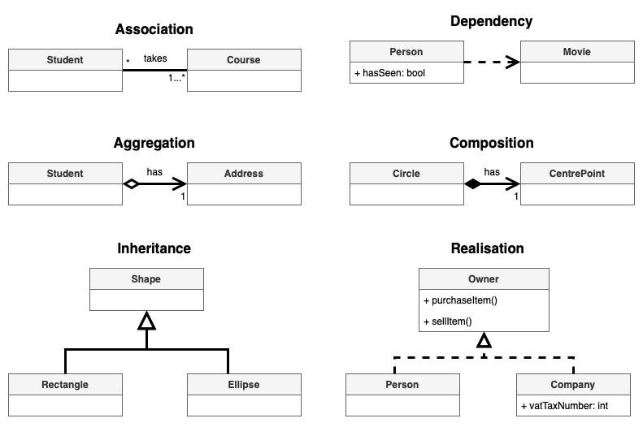
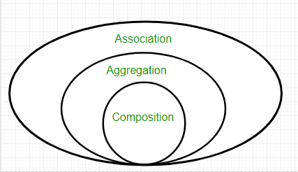

# design-pattern

Gang of Four Design Patterns

## [Creational Patterns](./creational/)

Creational patterns provide ways to instantiate single objects or groups of related objects.

* [Abstract Factory](./)
* [Builder](./)
* [Factory Method](./)
* [Prototype](./)
* [Singleton](./)

## [Structural Patterns](./structural/)

Structural patterns provide a manner to define relationships between classes or objects.

* [Adapter](./)
* [Bridge](./)
* [Composite](./)
* [Decorator](./)
* [Facade](./)
* [Flyweight](./)
* [Proxy](./)

## [Behavioural Patterns](./behavioural/)

Behavioural patterns define manners of communication between classes and objects.

* [Chain of Responsibility](./)
* [Command](./)
* [Interpreter](./)
* [Iterator](./)
* [Mediator](./)
* [Memento](./)
* [Observer](./)
* [State](./)
* [Strategy](./)
* [Template Method](./)
* [Visitor](./)

## References

* [Gang of Four Design Patterns](http://www.blackwasp.co.uk/gofpatterns.aspx)
* [C++ Programming: Code patterns design](https://en.wikibooks.org/wiki/C%2B%2B_Programming/Code/Design_Patterns)
* [draw.io](https://www.drawio.com/)

## Appendix

### [Connectors for relationships in UML class diagrams](https://www.drawio.com/blog/uml-class-diagrams)



#### Association



Association represents a relationship between two classes, indicating that one class knows about the other. This is depicted by a solid line connecting the two classes. For example, a Student enrolling in multiple Courses represents an association.

```cpp
class Course;  // Forward declaration

class Student {
 public:
  void enroll(Course* course) { /* ... */ }
};

class Course {
 public:
  void AddStudent(Student* student) { /* ... */ }
};
```

#### Dependency

Dependency indicates that **one class temporarily uses another class**. If the definition of the dependent class (`Movie`) changes, it may affect the class that depends on it (`Person`), but not vice versa. This is typically seen when one class uses another class as a parameter.

```cpp
class Movie {};

class Person {
 public:
  void watch(const Movie& movie) { /* ... */ }
};
```

#### Aggregation

Aggregation represents a relationship where one class contains another class as a part of itself. However, the contained class (`Address`) **can exist independently of the container class** (`Student`). This is a "whole-part" relationship where the part can exist independently of the whole.

```cpp
class Address {};

class Student {
 private:
  Address* address_;

 public:
  Student(Address* addr) : address_(addr) { /* ... */ }
};
```

#### Composition

Composition is a stronger form of aggregation, indicating that one class (`Circle`) owns another class (`CentrePoint`), and the owned class **cannot exist independently of the owner**. If the owner is destroyed, the owned class is also destroyed.

```cpp
class CentrePoint {};

class Circle {
 private:
  CentrePoint centre_;

 public:
  Circle() : centre_() { /* ... */ }
};
```

#### Inheritance (Generalization)

Inheritance (or generalization) shows that subclasses are **specialized versions of a parent class** ("is-a" relationship). The subclasses inherit attributes and behaviors from the parent class.

```cpp
class Shape {
 public:
  virtual void draw() = 0;
};

class Rectangle : public Shape {
 public:
  void draw() override { /* ... */ }
};

class Ellipse : public Shape {
 public:
  void draw() override { /* ... */ }
};
```

#### Implementation (Realization)

Implementation (or realization) indicates that a class **implements the methods defined by an interface** (blueprint class). Each implementing class can have its own specific implementation of the interface's methods.

```cpp
class Owner {
 public:
  virtual void PurchaseItem() = 0;
  virtual void SellItem() = 0;
};

class Person : public Owner {
 public:
  void PurchaseItem() override { /* ... */ }
  void SellItem() override { /* ... */ }
};

class Company : public Owner {
 private:
  int vat_tax_number_;

 public:
  void PurchaseItem() override { /* ... */ }
  void SellItem() override { /* ... */ }
};
```
